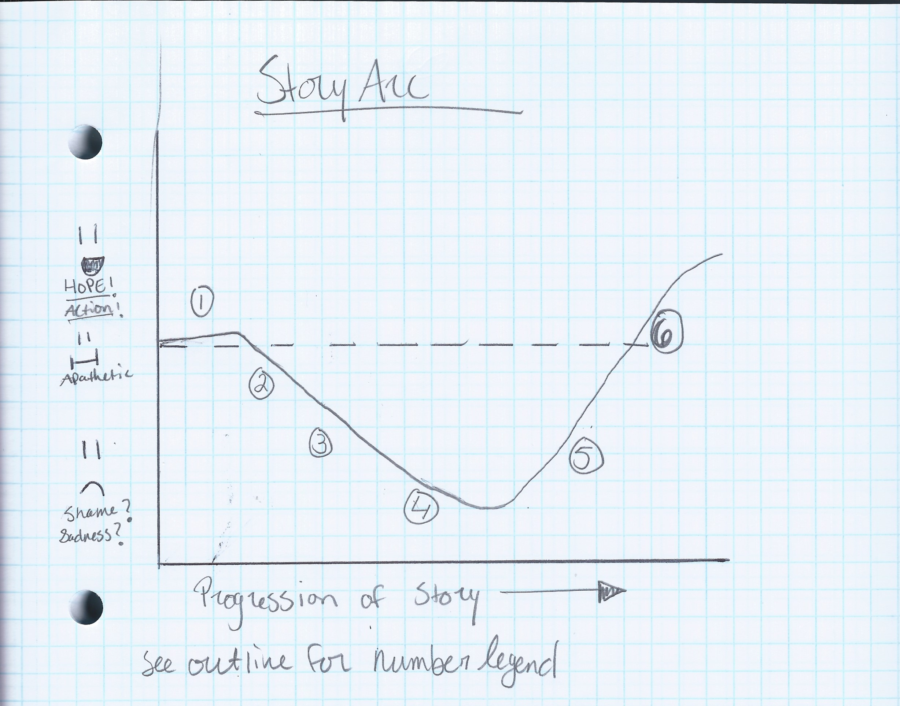
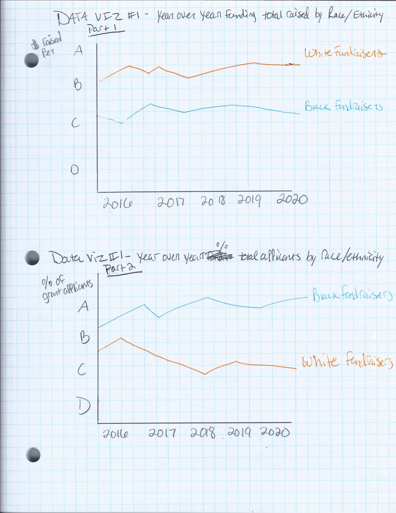
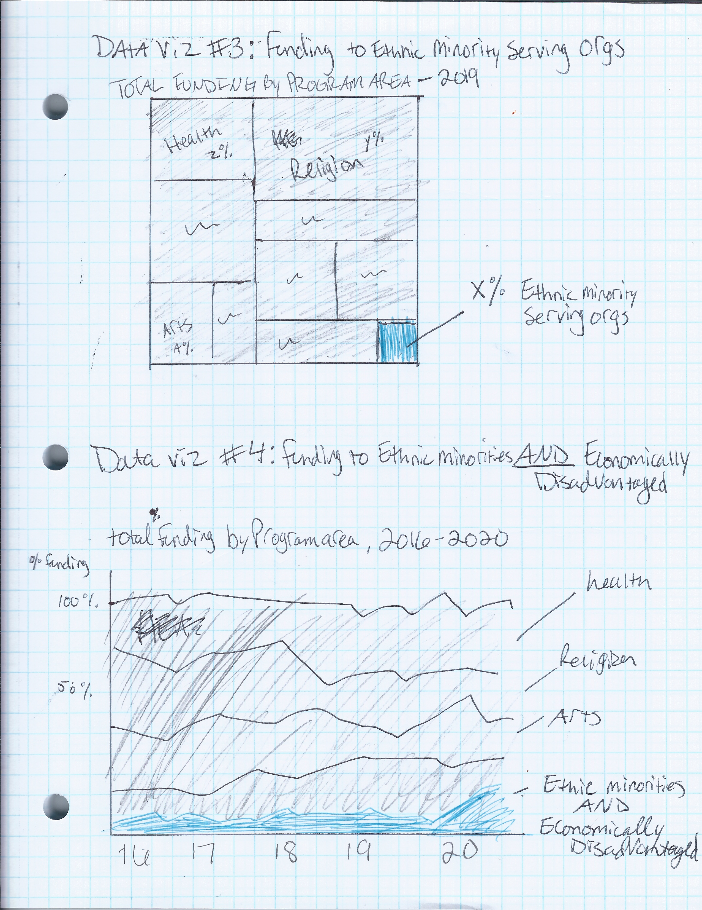
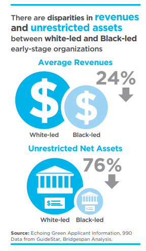

# Final Project: Racial Inequities in Philanthropy

## Part 1
### Outline
#### User/Audience Considerations
**Intended User/Audience:** Nonprofit Development Leaders; Foundation Leaders

**User Story**
* *As a reader, I want* **(an easy way to understand the severity of the issue)** *so that I can* **(persuade key stakeholders to make meaningful change quickly)**
* *I can do this by* **(emphasizing the severity and providing actionable solutions as a follow-up to the problem)**

**What are some ways this project can visualize elements of the user story?**
* Illustrate gaps and trends to show the severity and historical implications of the problem
* Guide the reader to a call to action that fits their specific circumstance

#### Story Outline
**Summary/Thesis:** A significant way in which systemic racism manifests in the nonprofit sector is in the exclusion and “othering” of Black fundraisers and Black led organizations (BLOs) in the fundraising process. This barrier to resources makes it much harder for BLOs to do the necessary work to protect communities that are facing the symptoms of systemic racism themselves, and thus it is the responsibility of the significantly white Development and Foundation sector to understand, address, and resolve this issue.

 1. Overview of nonprofit sector and the role of contributed income
    * a.	Size of sector (# of registered nonprofits in US) in 2016 
    * b.	Total nonprofit Contributed income for 2016 (396.52 billion)1
    * c.	Total giving to nonprofits in 2019 ($449.64 billion)2
    
    
 2. Lack of funding: not a new issue, but publicly accessible data is hard to find. Echoing Green applicant data provides the largest, most recent, publicly available dataset3
    * a.	DATA VIZ (1): 2 Line charts, showing year over year
    * b.	Total Raised by Race/Ethnicity
    * c.	Total % of Applicants by Race/Ethnicity
    
    
 3. Black Fundraisers receive less than their white counterparts, despite being a significantly larger proportion of the applicant pool
    * a.	DATA VIZ (2): Data Viz Project #2: [Nonprofit Fundraising Dollars Awarded by Race/Ethnicity](FundraisingData.md)
    
    
 4. Not just individuals: Ethnic Minority Serving organizations (no Black delineation in data) receive less too
    * a.	DATA VIZ (3): PROGRAM AREA: Ethnic Minority Serving Organizations
    * b.	Significant proportion of Black population under poverty line4  
      * i.	Extend above viz to add in Economically Disadvantaged program area: DATA VIZ (4)
      
 5. Recent Increase in Awareness
    * a. Accessible data 
    * b. Increase in reports5
    * CCF 10 principles6
    
 6. Call to Action
 * a. Foundation Leaders: [Trust Based Philanthropy Project](https://trustbasedphilanthropy.org/)7
 * b. Nonprofit Development Leaders: [Community Centric Fundraising](https://communitycentricfundraising.org/)8

 

#### References
1National Center for Charitable Statistics. “The Nonprofit Sector in Brief 2019,” June 2020.

2Giving USA. “Giving USA 2020: Charitable Giving Showed Solid Growth, Climbing to $449.64 Billion in 2019, One of the Highest Years for Giving on Record | Giving USA,” June 16, 2020. https://givingusa.org/giving-usa-2020-charitable-giving-showed-solid-growth-climbing-to-449-64-billion-in-2019-one-of-the-highest-years-for-giving-on-record/.

3Echoing Green. “State of Social Entrepreneurship 2020,” March 30, 2020. https://echoinggreen.org/news/state-of-social-entrepreneurship-2020/.

4KFF. “Poverty Rate by Race/Ethnicity,” October 23, 2020. https://www.kff.org/other/state-indicator/poverty-rate-by-raceethnicity/.

5 Batten, Susan Taylor, Edward M Jones, Leslie MacKrell, and Jerry Petit-Frere. “Guiding a Giving Response to Anti-Black Injustice,” August 2020. https://www.abfe.org/wp-content/uploads/2020/08/BRIDGESPAN-Report-Guiding-a-Giving-Response-to-Anti-Black-Injustice.pdf; “The Case for Funding Black-Led Social Change.” Emergent Pathways, LLC, December 2019. http://www.blacksocialchange.org/wp-content/uploads/2020/05/BSCFN_BLSCO_Report.pdf; Dorsey, Cheryl, Jeff Bradach, and Peter Kim. “Racial Equity and Philanthropy.” The Bridgespan Group, May 2020. https://www.bridgespan.org/bridgespan/Images/articles/racial-equity-and-philanthropy/racial-equity-and-philanthropy.pdf; “The State of Change: An Analysis of Women and People of Color in the Philanthropic Sector.” Council on Foundations, 2016.

6CCF. “CCF Principles.” Accessed November 20, 2020. https://communitycentricfundraising.org/ccf-principles/.

7Trust-Based Philanthropy. “Trust-Based Philanthropy.” Accessed November 20, 2020. https://trustbasedphilanthropy.org.

8Community Centric Fundraising. “Community Centric Fundraising- Home,” 2020. https://communitycentricfundraising.org/.

### Initial Sketches

### The Data
 1. Echoing Green Data Set
    * The main data set I will be using for the above sketched visualizations is the collection of data on Echoing Green's Fellowship Program applicants. This is one of the largest collections of data on social enterprise applicants (download data set [here](Echoing-Green-SSE2-2020-Dataset.xlsx)). The visualizations from this data set will serve as the core/achoring visualizations for outline points 2-4.

 2. Various Reports (see Footnote 5 in Outline Reference section)
    * Due to the inaccessibility of large data sets on these issues (the few that exist other than Echoing Green are all behind paywalls), I will also be using visualizations found in the many reports written by institutions who have accessed and analyzed this paywall-blocked data. As such, I will not be able to recreate these charts from the original source data, but I plan on changing the format/presentation of them to better communicate my story. For example, the following visualization is located on page 11 of [The Bridgespan Group's Racial Equity and Philanthropy Report](https://www.bridgespan.org/bridgespan/Images/articles/racial-equity-and-philanthropy/racial-equity-and-philanthropy.pdf). 
    
     
    
    The data used to create this viz is partially the Echoing Green data, but also partially a large data set of organizational 990s that I do not have the capability of collecting. As such, I plan on re-creating/re-designing the surface level information comunicated via this visualizaton to strengthen the arguments of the core visualizations from my Echoing Green data set that will anchor each outline point.

### Method and Medium
I plan on using Tableau to create the dynamic and interactive visualizations from the Echoing Green data set, Canva to redsign the static visualizations found in the reports discussed above, and Shorthand to host and present the final project. 

# Part 2
To view the Final Project Part II User Research Wireframe/Outline, click [here](https://carnegiemellon.shorthandstories.com/racial-inequities-in-nonprofit-fundraising/index.html)

## User Research

### Target Audience and Identification Method
**Target Audience:** Nonprofit Development Leaders; Foundation Leaders

** Representative Interviewees:** I asked the director of advancement at the Mattress Factory (my current internship) to take a look at it, as she is currently a nonprofit development leader and a former foundation leader. I also asked my manager at Mattress Factory, who is a current nonprofit development leader. I also reached out to past classmates who work in foundations. Lastly, I asked for feedback from fellow Master of Arts Management students, many of which also have development internships and experience.

### Interview Script
For this portion of the assignment, I built out a Google Forms survey that I sent to my interviewees so that they could answer on their own time, and without the pressure of me hovering and waiting for an answer. Because of the number of questions in the survey (22 in total), I have linked the Google Form for ease of review. You can view the Google Form [here](https://docs.google.com/forms/d/e/1FAIpQLScsrPtgBv_y_HLlOOtkNREZOXHzYeJYDzobQcscNb9bzmgCtA/viewform?usp=sf_link)

### Findings From Interviews and Relevant User Quotes
 Visualization #3 (Total giving in 2017) was the fan favorite; everyone felt that it was very effective in communicating the point
  User Quote: “I think this one might be my favorite! Contrasting proportions in this way is very effective. If there is a way to make it slightly larger in Shorthand though, it might be easier to read and understand at first glance.”
  
 Visualization #4 (Organizations Serving Black Men) needs some work. The title doesn’t serve to contextualize the data very well, and some people were just generally confused about what its main point was. Some people thought the white led orgs had 100% unrestricted budgets, rather than showing the disparate proportion like I meant.
  User Quote: “The visualization looks great and I can see a clear difference between orgs with white and Black leaders, I just needed some text to clarify the argument surrounding the total unrestricted assets number. I might add a sentence or two in your own words to supplement the quote and visualization. I was also confused about the title - is this visualization comparing orgs with white vs. Black leaders, but only orgs that serve Black men? Or is this data from all types of nonprofits?”

 People generally liked the flow and sequence of data and arguments, but a few people recommended that FIRST establishing the general lack of funding (viz 3) and proportionately smaller unrestricted assets Black serving organizations have (vz 4) would help make the Echoing Green data (viz 1 and 2) hit harder later.
  User Quote: “I might start with the data around smaller operating budgets and total unrestricted assets with lack of philanthropic investment as the problem. Then move to visualizations around funding inequalities.”

 A common critique was to pare down on the colors in both Viz 1 and in the shorthand website itself, especially when including hyperlinks.
  User Quote “Just because every bar is colored, it takes a few seconds to know where to focus. I wonder if there's a way to call out the major difference in the two orange bars.”
  User Quote: "I like the colors but there are kind of a lot of them, it may be helpful to remove one or two."

Everyone felt that the call to action was relevant, and enjoyed how I broke it down based on the reader type.

### Planned Changes
* I am first going to try rearranging my story flow: I will start with what is currently Viz 3 to establish the fact that the general funding landscape is scarce for Black people, and then I will move into the specific statistics.
 
* In what is currently Viz 1, I will grey out all of the bars aside from the White and Black race/ethnicity groups. I will also better distinguish the column titles
 
* I need to rework what is currently Viz 4 in general. I’m thinking of keeping the animation, but making it a stacked bar chart instead of a normal bar chart to show that it is a comparison of proportions rather than of values themselves. I also need to rethink the title as well as the context of the text around it to best prepare the reader to get the most out of it.
 
* I will be paring down on the colors in the shorthand website itself, and making sure hyperlinks are visible
 
* I will be sprucing up the Call to Action section a little bit to make it look more engaging. Perhaps making the hyperlinks buttons instead?

